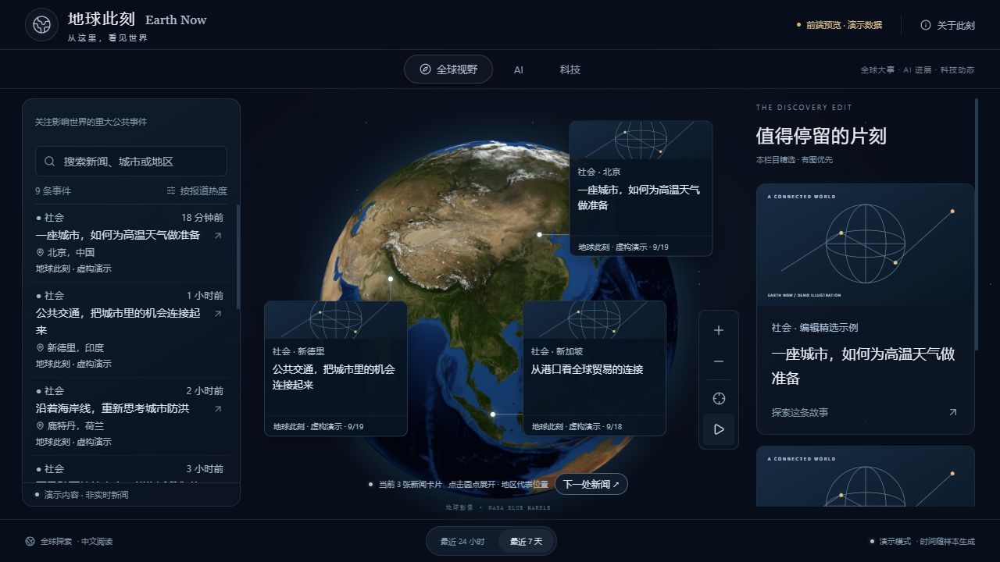
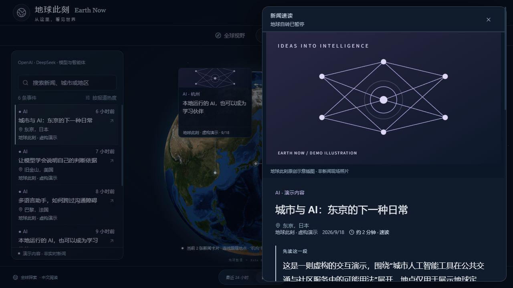

# 地球此刻 · Earth Now

**转动地球，发现新闻。** 面向桌面的新闻可视化开源项目，聚焦全球视野、AI 与科技，用地理标记和中文速读连接事件与地点。

[](https://github.com/cyxhrh/earth-now/actions/workflows/ci.yml) · [MIT](LICENSE) · [下载源码](https://github.com/cyxhrh/earth-now/releases) · [问题反馈](https://github.com/cyxhrh/earth-now/issues)



## 能做什么

- **地球探索**：无云 8K 地球，旋转、缩放、地区标记和连线；阅读时暂停自转。
- **三栏内容**：全球大事、AI 进展、科技动态，支持地点搜索和 24 小时 / 7 天筛选。
- **中文速读**：来源资料充分时提供图文概览、重点与分节阅读；资料较短则展示简讯，保留原文入口。
- **持续采集**：RSS 与官方来源、去重、地区覆盖优先、失败重试、翻译缓存和每日请求额度。
- **本地优先**：不需要账户、托管数据库或作者提供的 API；数据存放在自己的电脑。

<details>
<summary>查看中文阅读面板（虚构演示）</summary>



</details>

这是源码项目，需安装 Node.js；不是双击即用的桌面程序。没有作者运营的公共新闻服务。真实新闻需要网络，可选 AI 功能使用你自己的密钥并可能计费。

## 先体验：无需密钥

准备 **Node.js 22.12+（推荐 24 LTS）**、npm，以及支持 WebGL 的桌面浏览器。下载 Release 的源码 ZIP 并解压，在解压目录打开终端；也可以克隆：

```sh
git clone https://github.com/cyxhrh/earth-now.git
cd earth-now
npm ci
npm run demo
```

打开 **http://127.0.0.1:5173/**。三个栏目都有虚构的示例与原创示意插图，演示模式只启动前端，不启动采集、不读取本地新闻数据库、不请求模型。首次安装依赖需要网络，安装完成后的演示内容与地球贴图均从本机加载。

端口被占用可运行 `npm run demo -- --port 5174`。终端按 Ctrl+C 停止。

## 使用真实新闻

1. 停止演示，将 `.env.translation.example` **复制**为 `.env.translation.local`（可用文件管理器操作）。
2. 在该文件填写自己的 `DEEPSEEK_API_KEY`。其他选项可先保留默认值；不要把密钥放进前端 `VITE_` 变量。
3. 运行：

```sh
npm run dev
```

仍然打开 **http://127.0.0.1:5173/**。这次会同时启动前端、只读 API 和唯一采集 worker。首次批次可能需要几分钟；看到“尚未就绪”时，等待后点击重新加载，并查看终端来源状态。

**不填密钥也能采集**，但不生成 AI 翻译/速读；未翻译英文默认隐藏，可点击“也显示未翻译原文”。真实模式不自动拿虚构数据填补采集失败。机器关机、休眠或停止进程时，采集也会停止。

worker 默认每 30 分钟检查来源、每分钟处理队列；网页每两分钟检查已有批次，提示有更新后由读者点击替换，避免打断阅读。这不是实时新闻流。来源的网络可达性、更新节奏与授权条件由各发布方决定。

## 配置与费用

| 服务端配置               | 默认                 | 说明                                               |
| ------------------------ | -------------------- | -------------------------------------------------- |
| `DEEPSEEK_API_KEY`       | 空                   | 自己的密钥；空值不请求模型                         |
| `DEEPSEEK_MODEL`         | `deepseek-flash`     | 需为账号当前可用且兼容接口的模型                   |
| `NEWS_DAILY_AI_ATTEMPTS` | `200`                | 北京时间每天最多潜在模型请求；`0` 暂停新增模型工作 |
| `NEWS_POLL_MINUTES`      | `30`                 | 来源检查间隔，最小 10 分钟                         |
| `NEWS_DATA_DIR`          | `data`               | 数据库、缓存与备份目录                             |
| `HOST` / `PORT`          | `127.0.0.1` / `8787` | 后端监听地址与端口                                 |

请求上限不是人民币费用上限；真实失败请求也可能计费。缓存命中和未发送模型请求不扣应用内次数。详情见 [配置与排错](docs/configuration.md)。

主动来源包括中文新闻、国际媒体、区域科技来源与企业官方 RSS；当前新增上限按原报道北京时间日期计算：全球视野 15、AI 30、科技 40。日期、来源、地理定位和翻译都有局限，不保证每个国家每天都有新闻，也不代表独立事实核验。

## 开发与自部署

```sh
npm run lint        # 静态检查
npm test            # 隔离测试，不调用真实模型
npm run build       # 真实模式构建
npm run smoke       # 构建后检查：空库、合成 RSS、去重、API、备份与重启
npm run start:all   # 构建后提供网站/API 与 worker，默认 http://127.0.0.1:8787
```

静态演示构建：`npm run build:demo`，然后 `npm run preview`，打开终端显示的地址。`build` 与 `build:demo` 均写入 `dist/`，后执行的覆盖前者；真实自部署前重新运行 `npm run build`。

GitHub 仓库用于分发源码。GitHub Pages 只能托管静态演示，不能运行采集后台或保存数据库。本项目未自动开通 Pages。需要持续在线采集时，由使用者自行部署，参见 [自部署与备份](docs/self-hosting.md)。

## 项目结构

```text
src/features/globe/   地球渲染、卡片布局与运动
src/features/news/    数据契约、筛选、分组与阅读组件
server/              来源适配、采集、持久任务、翻译与速读、HTTP
scripts/             演示启动与隔离生命周期检查
public/              地球贴图和原创演示插图
docs/                配置、架构、扩展与部署说明
data/                本地运行数据（不提交）
```

[架构与扩展](docs/architecture.md) · [贡献指南](CONTRIBUTING.md) · [安全报告](SECURITY.md) · [更新日志](CHANGELOG.md) · [第三方素材](THIRD_PARTY_NOTICES.md)

## 边界与许可

V1 面向桌面。单台主机只运行一个 worker；内置 PGlite 目录不能被多机共享。按相同标题保守合并报道，暂不提供完整跨语言事件聚类或断网期间的全量历史补采。来源可能限制正文读取，此时保留简介与原文入口，不绕过访问限制。

代码与原创演示内容使用 [MIT License](LICENSE)。NASA 地球影像及新闻、图片、商标等第三方内容不因此改为 MIT；具体出处和使用边界见 [素材说明](THIRD_PARTY_NOTICES.md)。模型功能会把选中的公开报道文本发送给 DeepSeek；请按来源许可及你的使用场景配置。公开运营的适用要求由运营者自行核实。

**English:** Earth Now is a desktop, local-first news globe with Chinese reading briefs. Install Node.js 22.12+ and run `npm ci && npm run demo` for a no-key, fictional demo. Use `npm run dev` for live feeds; optional translation and briefs require your own server-side DeepSeek key. No hosted backend is provided. Source code is MIT; third-party content keeps its own terms.
