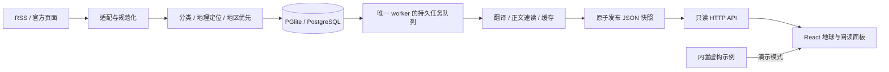

# 架构与扩展

## 模块边界

| 模块                                                           | 责任与入口                                                       |
| -------------------------------------------------------------- | ---------------------------------------------------------------- |
| `src/features/news/model.ts`                                   | 前后端共享 Zod 数据契约。图片仅允许 HTTPS 或明确的内置演示图路径 |
| `provider.ts` / `http-provider.ts` / `mock.ts`                 | 前端数据入口；真实失败不静默切换演示                             |
| `query.ts` / `events.ts` / `cardRanking.ts`                    | 筛选、保守同标题分组与展示排序                                   |
| `src/features/globe/`                                          | 地理投影、标记、卡片布局、遮挡与运动稳定；没有采集或模型逻辑     |
| `server/sources.ts` / `news.ts` / `official.ts` / `archive.ts` | 来源目录、RSS/页面适配、条目归一化                               |
| `editorial.ts` / `coverage.ts`                                 | 三栏收录条件、每日名额与薄弱地区优先                             |
| `location.ts` / `placeCatalog.ts` / `globalPlaces.ts`          | 文本地点匹配，保留定位依据；机构锚点由 `mapAnchor.ts` 单独标识   |
| `database.ts` / `pipeline.ts` / `worker.ts`                    | 历史、版本、任务、额度、增量采集与发布                           |
| `translation.ts` / `article.ts` / `briefs.ts`                  | 翻译、来源正文提取和基于正文的中文速读                           |
| `remote.ts` / `processLock.ts` / `atomic.ts`                   | 域名与跳转校验、超时与大小边界、本机独占、原子文件替换           |
| `store.ts` / `http.ts`                                         | 读取快照与只读 HTTP，不因浏览请求触发付费任务                    |

## 数据和状态

URL 规范化后的稳定 ID 与数据库唯一约束防止重复报道。同一报道变更会保存新版本，使旧版本任务失效。发布日期与数据库筛选日期保持一致；`first_seen` 另存首次入库时间。翻译按文本指纹复用，速读按正文指纹复用。

任务通常经历 pending → running → done；失败延迟重试，过期或过时版本退出队列。模型未配置、额度用完或锁忙会延后，不消耗失败重试次数。队列处理与读取 API 分离。

速读区分 `ready`、`limited`、`unavailable`，覆盖类型区分正文、部分正文、视频简介、图片说明。证据段落编号检查不等于逐句事实核验。没有足够资料时不补造背景。

## 添加新闻来源

1. 在 `server/sources.ts` 添加 `NewsSource`：稳定 id、名称、RSS URL、语言、分类、文章主机和图片主机白名单，并加入 `activeSources()`。
2. RSS 优先复用 `news.ts`，特殊页面用明确的适配函数；不要放宽为允许任意域名或任意跳转。
3. 如正文容器不同，在 `article.ts` 添加该来源的选择器；使用小型合成 HTML fixture 测试，避免把完整真实报道提交仓库。
4. 验证 `editorial.ts` 的栏目相关性，日期/时区、来源链接、位置精度及多地区统计。没有依据就不定位。
5. 添加 RSS 带属性分类、缺日期/图片、单条坏数据、网络失败的回归用例，并明确图片和内容的使用条件。

修改名额在 `editorial.ts`，修改地区分桶/优先规则在 `coverage.ts`。这两者不会自动增加上游可获取的内容；不要用其他地区或旧闻冒充当地新消息。

## 修改模型

同供应商先改 `DEEPSEEK_MODEL`。更换供应商时分别修改 `createDeepSeekTranslator` 和 `createBriefWriter` 的 endpoint、请求与响应解析，并补测试。保持输入新闻为不可信数据、严格 JSON 校验、超时、服务端密钥、脱敏错误及请求前额度预留。不要在前端实现模型请求。

## 测试

`npm test` 执行模块回归；模型调用通过模拟响应验证，来源使用 fixture。`npm run smoke` 在临时目录真实创建 PGlite，用合成 RSS 检查去重、发布、HTTP、备份及重启，禁止外部请求，不加载环境文件。CI 在 Windows、Linux、macOS 验证 Node 24，并覆盖 Linux 的最低 Node 22.12。

API 当前仍读取文件快照，并非高并发服务；PGlite 仅用于单机单 worker。多机扩展必须先迁移文件缓存/快照读写和所有权机制，单独设置 `DATABASE_URL` 不足以实现多机共享。
